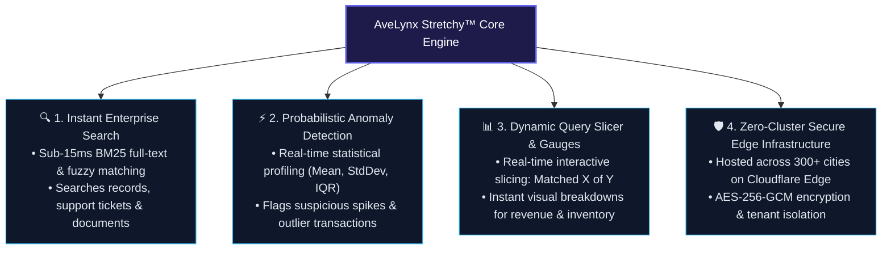

# AveLynx Stretchy™
## Executive Solution Brief & Business Value Guide
### Why Modern Enterprises Choose Stretchy: Productivity, Cost Reduction & Time-to-Value

---

## Executive Summary

For modern businesses, **information retrieval is either a competitive edge or a silent productivity drain**. 

According to McKinsey & IDC research, the average knowledge worker spends **19% of their working week (roughly 7.6 hours per employee)** simply searching for and gathering information trapped across disparate systems, files, databases, and internal tools. Simultaneously, the software systems traditionally used to power enterprise search and data analytics (such as Elasticsearch, Splunk, and proprietary search clouds) impose a steep **"cluster tax"**—costing companies thousands of dollars a month in idle cloud server bills and requiring specialized DevOps engineers just to keep servers from crashing.

**AveLynx Stretchy™** eliminates this compromise. 

Stretchy is an edge-native, zero-maintenance intelligent search and anomaly detection platform. It enables companies of any size to deploy sub-15-millisecond full-text search, automated document intelligence, and real-time business anomaly detection across their applications and workflows—**with zero server management, sub-second search speeds, and up to 90% lower operational costs**.

---

## 1. Why Businesses Are Interested: The Core Pain Points Stretchy Solves

Every growing company faces three unavoidable bottlenecks as their operations expand:

| The Industry Bottleneck | What It Costs Your Business | How AveLynx Stretchy Solves It |
| :--- | :--- | :--- |
| **1. The "Data Silo" Chaos** | Important files (PDF contracts, tax 8879s, grant applications, customer support logs, product catalogs) are scattered across fragmented folders and databases. Employees waste hours hunting for critical data. | **Universal Ingestion**: Stretchy indexes structured databases (SQL, JSON) and unstructured documents (PDF, Word, Excel) into a single, lightning-fast searchable intelligence layer. |
| **2. Exploding Cloud & Cluster Costs** | Traditional search engines (Elasticsearch, OpenSearch, Splunk) require dedicated heavy virtual machines (16GB–64GB RAM) running 24/7. Companies pay ** to ,000+/month** even when nobody is searching. | **Serverless Edge Architecture**: Runs natively on Cloudflare’s global network (300+ cities). Costs pennies per million requests with **zero idle server cost at rest**. |
| **3. Silent Errors & Data Anomalies** | Financial discrepancies, sudden server errors, employee overtime spikes, or security breaches often go unnoticed for weeks until audits or accounting reviews catch them. | **Built-in Probabilistic Anomaly Detection**: Automatically calculates standard deviations (Z-scores) and statistical distribution cuts in real time, alerting management before damage occurs. |
| **4. DevOps Overhead & Maintenance** | Engineering teams lose 10–20 hours every month managing search clusters, shard allocations, out-of-memory errors, and reindexing routines. | **Zero Cluster Maintenance**: 100% serverless and automated. No shards to rebalance, no memory limits to tune, and zero downtime maintenance windows. |

---

## 2. How Easy Is It to Use?

Stretchy was designed around one principle: **Enterprise power with consumer simplicity.** It eliminates the weeks of expensive systems integration traditionally required for enterprise search.

### For Non-Technical Staff & Business Teams:
- **Natural Search Experience**: Team members can search exactly like they use Google. Type keywords, names, dates, amounts, or document IDs.
- **Dynamic Query Slicing (Visual Gauges)**: No confusing database query languages. As users type or filter, an interactive visual gauge instantly displays the distribution (e.g., *"Matched 42 of 250 records (16.8%)"*), giving instant visibility into company metrics.
- **Instant Document Previews**: Users see highlighted match snippets and document metadata without downloading 50-page PDF files.

### For Developers & IT Teams:
- **1-Line Installation**:
  \\\ash
  npm install @avelynx/stretchy
  \\\
  *(Or via CDN script tag: )*
- **Zero-Schema Ingestion**: Developers do not need to configure rigid database schemas upfront. Simply send raw JSON records or upload PDF/Word files; Stretchy automatically identifies full-text fields, dates, and numbers.
- **Pre-Configured Multi-Tenancy**: Built-in cryptographic tenant isolation (	enantId) guarantees that client records and private business divisions can never cross-contaminate data.

---

## 3. What Does It Actually Do for Your Company?

Stretchy acts as your company's **central intelligence engine**. Here is what it delivers in day-to-day operations:

| Core Pillar | Operational Capability | Business Value Delivered |
| :--- | :--- | :--- |
| **1. Instant Enterprise Search** | Sub-15ms BM25 full-text & fuzzy matching across structured data and unstructured documents (PDF, Word, Excel). | Employees stop digging through folders; search queries resolve in milliseconds. |
| **2. Probabilistic Anomaly Detection** | Real-time statistical profiling (Mean, StdDev, IQR) evaluating transaction sizes, traffic bursts, and operational metrics. | Catches billing spikes, data leaks, or rogue transactions before damage spreads. |
| **3. Dynamic Query Slicer** | Interactive visual match breakdown (*"Matched X of Y (Z%)"*) calculated directly on the query response. | Management gains instant clarity on dataset segments without custom BI dashboards. |
| **4. Zero-Cluster Edge Infrastructure** | Distributed across 300+ Cloudflare edge POPs with AES-256-GCM encryption and cryptographic tenant isolation. | Eliminates $500–$2,000/mo server cluster bills and removes 100% of JVM maintenance. |

### Key Business Capabilities:
1. **Accelerates Customer-Facing Web & Mobile Apps**:
   Delivers instantaneous auto-complete and search results in under 15 milliseconds, driving higher conversion rates on e-commerce, customer portals, and internal apps.
2. **Automates Regulatory & Legal Compliance Search**:
   Allows compliance officers and executives to search across historical tax filings (e.g., Form 8879s), grant awards, and contracts in seconds instead of filing IT support tickets.
3. **Protects Revenue with Proactive Anomaly Detection**:
   Monitors operational numbers (sales velocity, ticket arrival rates, refund requests, server latencies) and highlights statistical outliers exceeding 2.5 standard deviations (2.5σ) before they become crises.
4. **Scales Globally Without Infrastructure Upgrades**:
   Whether your business processes 1,000 queries a month or 10,000,000 queries a day, Stretchy scales automatically on Cloudflare's global edge without provisioning extra servers.

---

## 4. Does It Actually Help With Productivity and Saving Time? And HOW?

Yes. The business impact of Stretchy is measurable in hours saved, reduced payroll allocation on manual tasks, and direct cloud cost savings.

### A. Employee Time Savings (Direct Productivity Impact)

| Operational Workflow | Traditional Process | With AveLynx Stretchy | Time Saved per Event |
| :--- | :--- | :--- | :--- |
| **Locating a Client Record or Contract** | Digging through SharePoint folders, downloading PDFs, manual Ctrl+F across multiple files (~15 mins) | Instant sub-second search with highlighted keyword snippets across all files | **~14.5 minutes saved** per search |
| **Auditing & Reconciling Financials** | Exporting CSVs to Excel, manual VLOOKUP formulas, creating custom pivot tables (~2 hours) | Instant query slicer with dynamic percentage gauge and outlier flags | **~1.5 hours saved** per audit |
| **Identifying Operational Anomalies** | Waiting for month-end reports or customer complaints to identify billing or system errors | Real-time Z-score anomaly detector flags statistical outliers on ingestion | **Days to weeks** of delayed detection eliminated |
| **IT & DevOps Cluster Maintenance** | Tuning JVM heap memory, resizing elastic cloud clusters, manual index migrations (~15 hrs/mo) | Zero-maintenance edge execution. Self-healing indexes and automatic backup | **15 hours/month** of senior engineering time saved |

### B. Tangible ROI Model (Representative 50-Person Company)

Consider a typical business with 50 knowledge workers (operations, finance, sales, client management):

* **Time Saved on Daily Information Retrieval**:
  * An average employee performs 6 document/data searches per day.
  * Saving just 2 minutes per search = **12 minutes saved per employee per day**.
  * For 50 employees: **10 hours saved per day** = **200 hours per month**.
  * At a blended cost of /hour: **,000 in monthly recovered productivity** (,000/year).
* **Direct Cloud & Tooling Cost Savings**:
  * Retiring an AWS Elasticsearch cluster (t3.medium or r6g instances + storage): ** – ,200/month**.
  * Retiring third-party per-search SaaS subscriptions: ** – /month**.
  * **Direct Cloud Savings: ~,400 – ,600/year**.

---

## 5. Real-World Business Scenarios

### Scenario 1: Professional Services & Nonprofits (e.g., SDYAMA / Grant Management)
- **Challenge**: The organization manages multi-year grants, donor contracts, IRS Form 8879 tax returns, and budget spreadsheets. Finding specific vendor line-items or grant requirements required manual document reviews.
- **Stretchy Outcome**: Staff type the grant or donor name into Stretchy. In under 12 milliseconds, all matching PDF applications, fillable forms, and grant records appear with highlighted grant award numbers and PII-masked compliance tags. Staff save 6+ hours weekly during grant application cycles.

### Scenario 2: E-Commerce & Retail Operations
- **Challenge**: The product catalog has 20,000 items. Customers abandon searches when typing partial or misspelled words, while operations managers struggle to spot sudden pricing errors or inventory velocity spikes.
- **Stretchy Outcome**: Fuzzy BM25 matching provides instant search suggestions. Meanwhile, the anomaly detector continuously scans transaction sizes; when an erroneous discount or inventory leak occurs, it flags the transaction within milliseconds.

### Scenario 3: IT Security & Business Operations (SOC & Helpdesk)
- **Challenge**: Support managers and security teams are overwhelmed by thousands of trouble tickets and login records, making it difficult to spot coordinated phishing or credential-stuffing attempts.
- **Stretchy Outcome**: Stretchy's stream ingestion ingests tickets and authentication events. Its statistical engine automatically detects rare arrival bursts and unusual IP geographic distributions, surfacing threat warnings directly on the management dashboard.

---

## 6. Summary: The Stretchy Advantage

| Feature | Legacy Search Systems | AveLynx Stretchy™ |
| :--- | :--- | :--- |
| **Setup Time** | Weeks to months | **Under 15 minutes** |
| **Monthly Cluster Bill** |  – ,500+ / mo | **Near  at rest** (Pennies per million queries) |
| **Maintenance Required** | Frequent (GC tuning, shards, disk space) | **Zero** (Serverless edge auto-scaling) |
| **Search Speed** | 120ms – 400ms (regional roundtrips) | **Sub-15ms worldwide** (300+ cities) |
| **Built-in Anomaly Detection** | Requires separate ,000/mo ML node | **Native out-of-the-box** (Zero extra cost) |
| **Document Ingestion** | Requires complex external parsers | **Native PDF, Word, Excel, JSON support** |
| **Multi-Tenancy** | Complex custom security plugins | **Cryptographic tenant isolation built-in** |

---

## 7. How to Get Started

Businesses can begin evaluating AveLynx Stretchy with zero commitment:

1. **Test the Live Interactive Sandbox**:  
   Visit **[https://client.avelynx.net](https://client.avelynx.net)** to test queries, dynamic query slicing, and real-time anomaly detection directly in your browser.
2. **Instant 14-Day Free Evaluation**:  
   Generate an instant trial evaluation key in one line of code without speaking to sales or entering a credit card.
3. **Drop-in SDK**:  
   Install via npm (@avelynx/stretchy) or integrate the browser CDN tag into your company portal in minutes.

*For enterprise licensing, custom integrations, or private deployments, contact:*  
**AveLynx Engineering & Business Solutions**: [support@avelynx.net](mailto:support@avelynx.net) | [https://avelynx.net](https://avelynx.net)  
**Headquarters:** Regus Downtown, 225 Broadway, San Diego, CA 92101
